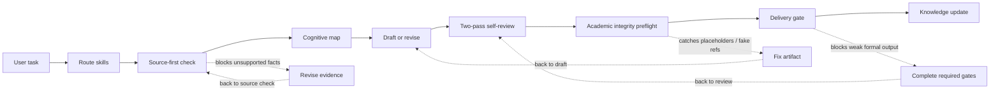

# Research Agent Starter Kit

Build a local research agent that thinks before writing, checks sources before claiming, and blocks weak formal outputs before delivery.

[中文说明](README_CN.md)

[](LICENSE)
[](https://www.python.org/)
[](#validation)

Use it with Codex, Claude Code, Cursor, or any coding agent that can read local files and follow `SKILL.md` instructions. The kit itself is file-based and local-first; the agent tool you choose may have its own login, subscription, or API-key requirements.

This starter kit is for dissertations, theses, articles, reports, proposals, and structured research projects where AI assistance must stay evidence-aware, auditable, and honest about its limits.

It does not replace source review, ethics/compliance approval, supervisor judgement, peer review, or institutional credentials. Those limits are visible by design.

## How It Works



The dashed paths are revision loops. They show where the agent should stop, fix the weak point, and rerun the relevant gate.

The workflow is strict where it matters:

1. **Plan before writing** — the agent maps the claim, gap, evidence status, warrant, and section role.
2. **Write with source boundaries** — formal claims require local source evidence or a visible `NEEDS VERIFICATION` boundary.
3. **Review before delivery** — drafts go through self-review, integrity checks, and delivery gates before they are treated as usable formal outputs.

## What's New

**v1.3.0** adds safer Obsidian onboarding and an external-review fallback for users who do not have Claude Code.

That means the starter kit now covers controlled knowledge-base navigation and optional second-opinion review through Claude Code, another Codex window, ChatGPT, Gemini, or a human reviewer. External review remains advisory only.

## Quick Start

If you use Obsidian: **Open knowledge-base/ as your Obsidian vault. Do not open the repository root.** See [Obsidian Setup](docs/OBSIDIAN_SETUP.md).

If you do not have Claude Code: use the external-review bundle workflow and paste the generated prompt into a separate Codex, ChatGPT, Claude, Gemini, or human review process. See [External Review Options](docs/EXTERNAL_REVIEW_OPTIONS.md).

```bash
git clone https://github.com/JonasLee12/research-agent-starter-kit.git
cd research-agent-starter-kit

python3 -m venv .venv
source .venv/bin/activate

pip install -r requirements.txt

# AGENTS.md is where you tell the agent what your project is about and which rules it must follow.
cp templates/AGENTS.example.md AGENTS.md
# Edit AGENTS.md with your project topic, sources, rules, and delivery needs.

python scripts/run_skill_evals.py
python scripts/validate_agent_schemas.py
python -m unittest discover -s tests
```

Optional neural vector retrieval:

```bash
pip install -r requirements-vector.txt
bash scripts/run_vector_index.sh
```

## What Problems It Solves

| Research-agent problem | Kit mechanism | Practical result |
|---|---|---|
| The agent invents facts or requirements | Source-first gate | Formal writing starts from local evidence, not memory |
| The draft sounds polished but the argument is thin | Cognitive frameworks + self-review loop | Claims, warrants, and paragraph logic are checked before delivery |
| Citations look correct but may not support the claim | Citation audit and source-readiness matrix | The system separates citation consistency from claim support |
| Knowledge grows chaotically across chats and files | Self-growing KB workflow | New notes move through raw inbox, growth queue, and compiled wiki with boundaries |
| Retrieval results get mistaken for evidence | Retrieval protocol | Search results stay candidate-only until source sections are reviewed |
| Formal documents are delivered too early | Delivery guard and checkpoints | Outputs can be blocked when required review gates are missing |
| Users do not have Claude Code | External-review bundle | Users can still request a second opinion through Codex, ChatGPT, another LLM chat, or a human reviewer |
| Public sharing risks leaking private project data | Privacy checks and `.gitignore` boundaries | Generated indexes, audit logs, and raw/private data stay local |

## Core Pieces

| Piece | Where it lives | What it does |
|---|---|---|
| Skills | `.agents/skills/` | Local instructions for routing, writing, review, source checks, KB operations, and maintenance |
| Runtime routing | `scripts/agent_runtime.py` | Classifies task types and lists required skills, files, and gates |
| Source readiness | `knowledge-base/SOURCE_READINESS_MATRIX.md` | Tracks whether a source is metadata-only, partly reviewed, or citation-ready |
| Self-growing KB | `knowledge-base/self-growing/` | Manages controlled knowledge-base growth |
| Retrieval | `scripts/local_retrieval_search.py`, `scripts/build_agent_index.py` | Builds local searchable indexes without replacing source review |
| Optional vector search | `scripts/build_vector_index.py` | Adds ChromaDB + sentence-transformers retrieval when installed |
| Integrity preflight | `.agents/skills/academic-integrity-preflight/`, `scripts/academic_integrity_preflight.py` | Checks prompt residue, placeholders, fake references, unsupported claims, and disclosure-boundary risks |
| External review fallback | `scripts/build_external_review_bundle.py`, `templates/prompts/EXTERNAL_REVIEWER_PROMPT.md` | Builds a local review bundle for Codex, ChatGPT, Claude, Gemini, or human review without uploading anything |
| Release surface verification | `.agents/skills/release-surface-verification/` | Checks GitHub release pages, About/sidebar, topics, rendered README/docs, and public links before claiming a release is complete |
| Delivery pipeline | `research-wiki/DOCUMENT_PIPELINE.md` | Splits formal work into THINKING, WRITING, and DELIVERY checkpoints |

## Scope And Limits

This kit is deliberately strict about what it cannot prove.

- It cannot prove that a source supports a claim without source-section review.
- It cannot turn retrieval results into evidence.
- It cannot access subscription databases such as Scopus, Web of Science, or EBSCO without valid institutional credentials.
- It cannot complete ethics approval, compliance approval, peer review, or supervisor approval.
- It cannot guarantee marks, publication, funding, acceptance, or official approval.
- It cannot stop someone from manually bypassing the workflow outside the agent pipeline.

These limits are part of the design. The system should make weak evidence visible instead of hiding it behind fluent prose.

## Validation

The public template currently reports **23/23 skill evaluations passing**.
The badge reflects the published template state; rerun the checks after customising the kit.

```bash
python scripts/run_skill_evals.py
python scripts/validate_agent_schemas.py
python -m unittest discover -s tests
python scripts/run_behavioral_evidence_checks.py
bash scripts/privacy_check.sh
```

Optional vector smoke test:

```bash
bash scripts/run_vector_index.sh
```

## More Setup

<details>
<summary>Customise the starter kit for your project</summary>

### Add project requirements

Place marking criteria, client requirements, ethics/compliance notes, or formal guidance in `university-guidance/`, `compliance/`, or your own project-specific folder. See `university-guidance/EXAMPLE_RUBRIC_GUIDE.md` for the expected style.

### Add your own skills

Create a new directory in `.agents/skills/your-skill-name/` with a `SKILL.md` file. Register eval test cases in `research-wiki/SKILL_EVAL_REGISTRY.md`. See [CONTRIBUTING.md](CONTRIBUTING.md) for requirements.

### Configure Zotero

See `research-wiki/ZOTERO_AND_CITATION_WORKFLOW_SPEC.md`.

### Set up the self-growing knowledge base

Start with `knowledge-base/self-growing/README.md`, then run:

```bash
python scripts/kb_health_check.py
python scripts/build_agent_index.py --rebuild --summary
python scripts/local_retrieval_search.py --rebuild --query "source readiness"
```

### Set up Obsidian safely

Open knowledge-base/ as your Obsidian vault. Do not open the repository root.

For a cleaner personal notebook, copy `templates/obsidian-vault/` to a location outside this repository and open the copied folder in Obsidian.

See [Obsidian Setup](docs/OBSIDIAN_SETUP.md).

### Get an external second opinion without Claude Code

Build a local review bundle:

```bash
python scripts/build_external_review_bundle.py path/to/draft.md
```

Then inspect `privacy_scan.md` and copy `EXTERNAL_REVIEW_PROMPT.md` into a separate Codex, ChatGPT, Claude, Gemini, or human review process if safe.

See [External Review Options](docs/EXTERNAL_REVIEW_OPTIONS.md).

### Adapt cognitive frameworks

Edit `.agents/skills/cognitive-frameworks/SKILL.md` to adjust gap classifications, warrant quality tests, or rhetorical moves for your discipline.

</details>

## Documentation

<details open>
<summary>Read next</summary>

- [Architecture](docs/architecture.md) — Full system diagram
- [Dual Window Guide](docs/DUAL_WINDOW_GUIDE.md) — Production and Maintenance window workflow
- [Skill Development Guide](docs/SKILL_DEVELOPMENT_GUIDE.md) — How to create and test new skills
- [Weekly Literature Gap-Watch Automation](docs/WEEKLY_LITERATURE_GAP_WATCH_AUTOMATION.md) — Candidate-only weekly literature monitoring
- [Obsidian Setup](docs/OBSIDIAN_SETUP.md) — Open the clean knowledge layer, not the repository root
- [External Review Options](docs/EXTERNAL_REVIEW_OPTIONS.md) — Use Claude Code, Codex, ChatGPT, Gemini, or human review as advisory feedback
- [Self-Growing Knowledge Base](knowledge-base/self-growing/README.md) — Controlled knowledge-base growth workflow
- [Retrieval Protocol](research-wiki/RETRIEVAL_PROTOCOL.md) — How the local retrieval layers work together
- [Document Pipeline](research-wiki/DOCUMENT_PIPELINE.md) — Staged checkpoint delivery process
- [Software and Plugin Requirements](docs/SOFTWARE_AND_PLUGIN_REQUIREMENTS.md) — Required and optional tools

</details>

## Acknowledgements

See [ACKNOWLEDGEMENTS.md](ACKNOWLEDGEMENTS.md) for open-source projects and workflows that inspired this system.

## License

[MIT](LICENSE)
