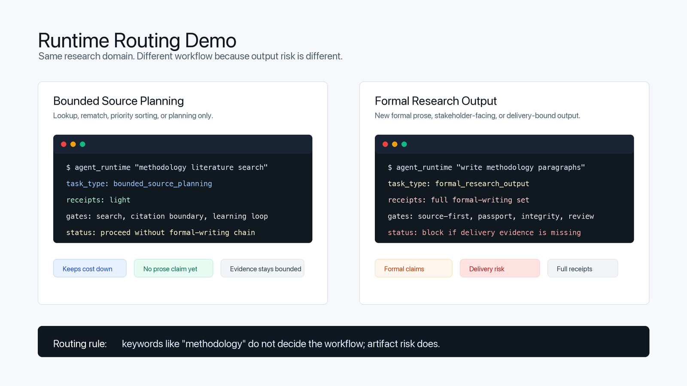
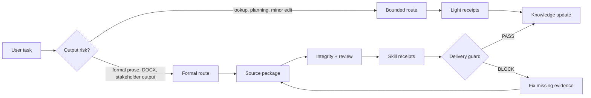

# Research Agent Starter Kit

Local-first research-agent workflows for people who need defensible formal outputs, not just fluent drafts.

This starter kit helps a coding agent check sources before claims, route small tasks lightly, leave evidence receipts for required gates, and flag weak Word/PDF or stakeholder-facing outputs before they are treated as usable.

[中文说明](README_CN.md)

[](LICENSE)
[](https://www.python.org/)
[](#validation)

License boundary: this repository is source-available under the [PolyForm Noncommercial License 1.0.0](LICENSE). Personal, educational, research, and other non-commercial use is allowed. Commercial use, resale, paid hosting/SaaS, paid training or consulting productisation, and redistribution as part of a paid product require prior written permission.

Use it with Codex, Claude Code, Cursor, or any coding agent that can read local files and follow `SKILL.md` instructions. The kit itself is file-based and local-first; your agent tool may have its own login, subscription, API-key requirements, or skill-discovery behaviour, but the Python checks remain usable even when skills are not auto-discovered.

Built for researchers working under citation, evidence, compliance, style, or delivery requirements: dissertations, theses, articles, reports, proposals, evidence syntheses, and structured research projects.

It does not replace source review, ethics or compliance approval, supervisor judgement, peer review, or institutional credentials. The point is to make those limits visible before polished text hides them.

## What It Protects

| Risk | Guard |
|---|---|
| A fluent draft invents facts or overuses metadata | Source-first gate and source-readiness matrix |
| A small lookup becomes an expensive formal-writing workflow | Bounded routing and light receipts |
| A later-stage artifact ignores earlier decisions | Stage Continuity and Token-Aware Recall |
| A skill is claimed but never actually ran | Skill execution receipts |
| A Word/PDF deliverable loses structure or skips checks | Formal delivery guard and DOCX structure/layout checks |
| A formal claim becomes stronger than its evidence | Claim Ledger Lite |
| A public or rendered surface is claimed fixed without being opened | Visible Output QA |

## Concrete Routing Example

```bash
python scripts/agent_runtime.py "Run methodology literature search and rematch sources" --window Production
# bounded_source_planning -> light receipts for source planning, search, citation boundary, learning loop

python scripts/agent_runtime.py "Write two formal methodology paragraphs synthesising the methodology literature" --window Production
# formal_research_output -> source-first, Material Passport, integrity preflight, cognitive planning, self-review, style/document gates
```



## How It Works



This diagram shows the public control path. Small tasks stay light; formal outputs move through source packaging, review evidence, receipts, and a delivery guard. The full internal formal-writing chain is still documented in the project skills and scripts.

The workflow is strict where it matters:

1. **Check evidence before writing** — formal claims require reviewed source-section evidence or a visible `NEEDS VERIFICATION` boundary. Metadata, a saved PDF, or a search result is not enough by itself.
2. **Plan the argument before drafting** — the agent maps the claim, gap, evidence status, warrant, and section role.
3. **Review before delivery** — drafts go through source packaging, integrity preflight, cognitive planning, self-review, authorial voice checks, style fingerprint scans, skill execution receipts, and delivery gates before they are treated as usable formal outputs.
4. **Keep review concrete** — two-pass self-review records concrete weaknesses, revision actions, and a fresh second judgement.
5. **Update knowledge deliberately** — useful decisions and reviewed sources can be added to the knowledge base, but retrieval and notes remain navigation aids until source readiness is confirmed.

## What's New

**Unreleased** adds Claim Ledger Lite, Visible Output QA, borrowed-pattern boundary lint, and beginner onboarding guides.

That means formal claims can now carry a small claim ledger with evidence status, cannot-prove boundary, concept contract, allowed wording, and review action. Visible outputs such as Word/PDF, figures, GitHub pages, Obsidian views, and browser pages now need rendered or preview evidence before they are described as checked. Borrowed style/workflow patterns are linted so public inspiration does not become detector-evasion, detector-score, authorship-verdict, or humanising-as-evasion guidance.

It also adds first-day guides for users who do not yet know Codex or GitHub: [Beginner README](docs/BEGINNER_README.md) and [中文新手 README](docs/BEGINNER_README_CN.md).

**v1.7.0** adds bounded routing and session-log integrity checks.

That means the agent can now keep small tasks small. Source planning, literature-priority sorting, source lookup, citation-key fixes, reference-format edits, and typos use light receipt sets unless the task asks for formal prose, Word/DOCX, stakeholder-facing or submission-facing output, or protected source-of-record edits. Methodology or literature-review keywords alone no longer justify the full formal-writing chain.

It also adds `scripts/session_log_integrity_check.py`, so maintenance audits can block malformed JSONL, illegal window labels, runtime/window mismatches, and unpaired session starts instead of treating log drift as harmless bookkeeping.

**v1.6.0** adds Stage Continuity and Token-Aware Recall.

That means a long-running project can now prevent a common cross-stage failure: drafting a later-stage method plan, instrument, analysis plan, or stakeholder-facing memo without checking earlier source-of-record decisions. The runtime emits a recall tier, the Stage Graph points to upstream dependencies, and a Stage Continuity Capsule records what was inherited, what remains open, and what must not change without confirmation.

It also keeps context use proportionate. Format-only fixes and bookkeeping stay light; high-risk stage changes get targeted recall; supersession or "skip upstream" cases surface the dependency first and record any accepted override as risk, not as a pass.

**v1.5.2** adds DOCX Structure and Layout Guards.

That means formal Word delivery can now block a common rendering failure: Markdown tables flattening into pipe-delimited paragraphs, or a revised DOCX losing tables, headings, lists, or visible hierarchy compared with a previous accepted Word version. These checks are deterministic safeguards inside the delivery workflow; they do not replace visual page inspection or project-specific format requirements.

**v1.5.1** adds Style Fingerprint Gate and Skill Execution Receipts.

That means formal writing can now require local evidence receipts for key checks. The runtime lists task-specific receipt requirements, scanner-style gates create checkable reports, and the delivery guard can block missing receipts instead of accepting a chat claim that a skill was used. Receipts show that evidence artifacts exist; they do not prove the analysis is sufficient or that the evidence is true.

This release also adds a deterministic fixed phrase-list scan for repeated binary contrast templates such as "rather than", "not...but", "不是...而是", and "而不是". It is a writing-quality safeguard, not a general stylometric scan or AI detector.

**v1.5.0** adds Authorial Voice Integrity and a Real Project Operating Guide.

That means requests such as "make this less AI-like", "humanise this", or "lower AI rate" are routed into authorial voice, academic/professional integrity, and evidence-led style. The system does not promise detector scores or use evasion tactics.

It also adds a practical guide for turning the starter kit into a working dissertation, thesis, manuscript, report, or evidence-synthesis agent.

**v1.4.0** added Material Passport and Formal Delivery Guard.

That means formal research artifacts now get a compact evidence passport before they move forward, and final Word/PDF/stakeholder-facing delivery can be blocked when required lock, integrity, citation, compliance, or requirement evidence is missing.

**v1.3.1** added release-surface verification and a public sync policy.

That means the starter kit now checks GitHub-visible release surfaces before claiming a public update is complete, and it defines what can be synced from a private project workspace into the public template without leaking private research content.

**v1.3.0** added safer Obsidian onboarding and an external-review fallback for users who do not have Claude Code. External review remains advisory only.

## Quick Start

If you use Obsidian: **Open knowledge-base/ as your Obsidian vault. Do not open the repository root.** See [Obsidian Setup](docs/OBSIDIAN_SETUP.md).

If you are new to Codex or GitHub: start with [Beginner README](docs/BEGINNER_README.md) or [中文新手 README](docs/BEGINNER_README_CN.md).

If you do not have Claude Code: use the external-review bundle workflow and paste the generated prompt into a separate Codex, ChatGPT, Claude, Gemini, or human review process. See [External Review Options](docs/EXTERNAL_REVIEW_OPTIONS.md).

If you want to use the kit on a real project, start with [Real Project Operating Guide](docs/REAL_PROJECT_OPERATING_GUIDE.md).

```bash
git clone https://github.com/JonasLee12/research-agent-starter-kit.git
cd research-agent-starter-kit

python3 -m venv .venv
source .venv/bin/activate

pip install -r requirements.txt

# AGENTS.md is where you tell the agent what your project is about and which rules it must follow.
cp templates/AGENTS.example.md AGENTS.md
# Edit AGENTS.md with your project topic, sources, rules, and delivery needs.

python scripts/run_skill_evals.py
python scripts/validate_agent_schemas.py
python -m unittest discover -s tests
```

Optional neural vector retrieval:

```bash
pip install -r requirements-vector.txt
bash scripts/run_vector_index.sh
```

## What Problems It Solves

| Research-agent problem | Kit mechanism | Practical result |
|---|---|---|
| The agent invents facts or requirements | Source-first gate | Formal writing starts from local evidence, not memory |
| The draft sounds polished but the argument is thin | Cognitive frameworks + self-review loop | Claims, warrants, and paragraph logic are checked before delivery |
| A later-stage artifact ignores earlier project commitments | Stage Continuity + Token-Aware Recall | The agent checks the Stage Graph, writes a targeted capsule, and recomputes recall when the task changes |
| The agent over-routes source planning as formal writing | Bounded runtime routes | Source planning, lookup, and minor edits use light receipt sets until the task truly asks for formal output |
| The user asks to reduce AI rate or humanise prose | Authorial voice integrity | The detector-evasion framing is refused and converted into evidence-led authorial voice work |
| A skill is mentioned but not actually executed | Skill execution receipts | Required checks must leave local evidence receipts; receipts are not proof of analytical quality |
| Formal claims overrun the evidence | Claim Ledger Lite | Claim wording, cannot-prove boundary, concept contract, and review action are recorded before formal delivery |
| Visible outputs are claimed from source-layer changes only | Visible Output QA | Rendered/previewed surfaces are checked against the communication job before completion is claimed |
| Formal prose repeats mechanical contrast templates | Style fingerprint gate | A fixed phrase list, including `rather than` / `not...but`, is scanned before delivery |
| Citations look correct but may not support the claim | Citation audit and source-readiness matrix | The system separates citation consistency from claim support |
| Knowledge grows chaotically across chats and files | Self-growing KB workflow | New notes move through raw inbox, growth queue, and compiled wiki with boundaries |
| Retrieval results get mistaken for evidence | Retrieval protocol | Search results stay candidate-only until source sections are reviewed |
| Formal documents are delivered too early | Delivery guard and checkpoints | Outputs can be blocked when required review gates are missing |
| Users do not have Claude Code | External-review bundle | Users can still request a second opinion through Codex, ChatGPT, another LLM chat, or a human reviewer |
| Public sharing risks leaking private project data | Privacy checks and `.gitignore` boundaries | Generated indexes, audit logs, and raw/private data stay local |

## Core Pieces

| Piece | Where it lives | What it does |
|---|---|---|
| Skills | `.agents/skills/` | Local instructions for routing, writing, review, source checks, KB operations, and maintenance |
| Runtime routing | `scripts/agent_runtime.py` | Classifies task types and lists required skills, files, and gates |
| Session log integrity | `scripts/session_log_integrity_check.py` | Checks JSONL validity, window labels, runtime/window alignment, paired sessions, and timestamp parseability |
| Source readiness | `knowledge-base/SOURCE_READINESS_MATRIX.md` | Tracks whether a source is metadata-only, partly reviewed, or citation-ready |
| Self-growing KB | `knowledge-base/self-growing/` | Manages controlled knowledge-base growth |
| Retrieval | `scripts/local_retrieval_search.py`, `scripts/build_agent_index.py` | Builds local searchable indexes without replacing source review |
| Optional vector search | `scripts/build_vector_index.py` | Adds ChromaDB + sentence-transformers retrieval when installed |
| Integrity preflight | `.agents/skills/academic-integrity-preflight/`, `scripts/academic_integrity_preflight.py` | Checks prompt residue, placeholders, fake references, unsupported claims, and disclosure-boundary risks |
| Authorial voice integrity | `.agents/skills/authorial-voice-integrity/`, `scripts/authorial_voice_scan.py`, `research-wiki/AI_WRITING_AUTHORIAL_VOICE_POLICY.md` | Improves authorial judgement and academic/professional voice without detector-evasion claims |
| Style fingerprint gate | `.agents/skills/style-fingerprint-gate/`, `scripts/style_fingerprint_scan.py` | Scans repeated binary negative-contrast templates before formal delivery |
| Skill execution receipts | `scripts/skill_execution_receipt.py`, `research-wiki/SKILL_EXECUTION_RECEIPT_PROTOCOL.md` | Records task ID, skill, stage, status, evidence path, and evidence hash for required gates |
| Material Passport | `.agents/skills/material-passport/`, `scripts/material_passport.py` | Packages recorded source readiness, user-supplied compliance/requirement status, citation boundaries, and `TO CONFIRM` items before formal artifacts move forward |
| Formal delivery guard | `.agents/skills/formal-delivery-guard/`, `scripts/pre_delivery_lock.py`, `scripts/formal_delivery_guard.py` | Creates/checks pre-delivery locks and blocks formal delivery when required evidence or DOCX structure/layout checks are missing |
| DOCX structure/layout guards | `scripts/markdown_docx_structure_check.py`, `scripts/docx_layout_review_check.py` | Checks that Markdown tables become real Word tables and that important DOCX revisions do not silently lose visible structure |
| External review fallback | `scripts/build_external_review_bundle.py`, `templates/prompts/EXTERNAL_REVIEWER_PROMPT.md` | Builds a local review bundle with no automatic upload; the user decides what to share with Codex, ChatGPT, Claude, Gemini, or a human reviewer |
| Release surface verification | `.agents/skills/release-surface-verification/` | Checks the user-visible GitHub release page, About/sidebar, topics, rendered README/docs, and public links before claiming a release is complete |
| Public sync policy | `PUBLIC_SYNC_POLICY.md` | Defines shared core files, private-only content, public-only onboarding files, sync checks, and release-boundary rules |
| Delivery pipeline | `research-wiki/DOCUMENT_PIPELINE.md` | Splits formal work into THINKING, WRITING, and DELIVERY checkpoints |
| Stage continuity | `research-wiki/STAGE_GRAPH.md`, `research-wiki/STAGE_CONTINUITY_PROTOCOL.md`, `scripts/stage_recall_policy.py`, `scripts/stage_continuity_capsule_check.py` | Prevents later-stage work from ignoring upstream decisions while keeping recall token-aware |
| Claim Ledger Lite | `research-wiki/CLAIM_LEDGER_LITE_PROTOCOL.md`, `scripts/claim_ledger_lite_check.py` | Keeps formal claims within evidence boundaries without turning every lookup into a heavy audit |
| Visible Output QA | `research-wiki/VISIBLE_OUTPUT_QA_PROTOCOL.md`, `scripts/visible_output_qa_check.py` | Requires rendered/preview evidence for Word/PDF, figure, GitHub, Obsidian, browser, or other visible delivery surfaces |
| Borrowed-pattern boundary lint | `scripts/borrowed_pattern_boundary_lint.py` | Blocks unsafe imported style/workflow wording such as detector-evasion or authorship-verdict promises |

## Scope And Limits

This kit is deliberately strict about what it cannot prove.

- It cannot prove that a source supports a claim without source-section review.
- It cannot turn retrieval results into evidence.
- It cannot access subscription databases such as Scopus, Web of Science, or EBSCO without valid institutional credentials.
- It cannot complete ethics approval, compliance approval, peer review, or supervisor approval.
- It cannot guarantee marks, publication, funding, acceptance, or official approval.
- It cannot stop someone from manually bypassing the workflow outside the agent pipeline.
- Skill receipts prove execution evidence exists. They do not prove the underlying analysis is academically sufficient, truthful, or acted on.
- Style and authorial voice scans are advisory writing-quality checks. They are not AI detectors.

These limits are part of the design. The system should make weak evidence visible instead of hiding it behind fluent prose.

## Validation

The public template currently reports **53/53 skill evaluations passing**.
These are lightweight static/routing checks for high-risk cases, not proof of behavioural quality. The badge reflects the published template state; rerun the checks after customising the kit.

```bash
python scripts/run_skill_evals.py
python scripts/validate_agent_schemas.py
python scripts/session_log_integrity_check.py --strict --no-report
python -m unittest discover -s tests
python scripts/run_behavioral_evidence_checks.py
python scripts/borrowed_pattern_boundary_lint.py --no-report
bash scripts/privacy_check.sh
```

Formal delivery helpers:

```bash
python scripts/material_passport.py --artifact path/to/draft.md --scope short
python scripts/claim_ledger_lite_check.py path/to/claim-ledger.md
python scripts/authorial_voice_scan.py --target path/to/draft.md
python scripts/style_fingerprint_scan.py path/to/draft.md --strict
python scripts/visible_output_qa_check.py path/to/visible-output-qa.md
python scripts/skill_execution_receipt.py create --task-id my-task --skill style-fingerprint-gate --stage writing --artifact path/to/draft.md --status PASS --evidence audit-reports/style-fingerprint/my-report.md
python scripts/pre_delivery_lock.py create --target path/to/final.docx --runtime-receipt path/to/receipt.md --material-passport path/to/passport.md --source-map path/to/source-map.md --integrity-preflight path/to/integrity.md --quality-gate path/to/quality.md
python scripts/formal_delivery_guard.py --artifact path/to/final.docx --source path/to/source.md --require-style-fingerprint --require-skill-receipts --task-id my-task
python scripts/markdown_docx_structure_check.py --markdown path/to/source.md --docx path/to/final.docx --previous-docx path/to/accepted.docx
python scripts/docx_layout_review_check.py --docx path/to/final.docx --markdown path/to/source.md --previous-docx path/to/accepted.docx
```

DOCX exception flags such as `--skip-structure-parity`, `--skip-layout-review`, `--allow-table-loss`, and `--allow-layout-regression` require `--layout-decision-reason`. Use them only for explicit documented layout decisions, not as a convenience bypass.

Optional vector smoke test:

```bash
bash scripts/run_vector_index.sh
```

## More Setup

<details>
<summary>Customise the starter kit for your project</summary>

### Add project requirements

Place marking criteria, client requirements, ethics/compliance notes, or formal guidance in `university-guidance/`, `compliance/`, or your own project-specific folder. See `university-guidance/EXAMPLE_RUBRIC_GUIDE.md` for the expected style.

### Add your own skills

Create a new directory in `.agents/skills/your-skill-name/` with a `SKILL.md` file. Register eval test cases in `research-wiki/SKILL_EVAL_REGISTRY.md`. See [CONTRIBUTING.md](CONTRIBUTING.md) for requirements.

### Keep a private project and public template aligned

Use [Public Sync Policy](PUBLIC_SYNC_POLICY.md) before moving improvements from a private research workspace into this public starter kit. It separates reusable shared-core improvements from private project material that must not be published.

The policy defines:

- shared core files that may be generalised and synced;
- private-only files that must never be published;
- release-surface checks needed before calling an update complete.

### Configure Zotero

See `research-wiki/ZOTERO_AND_CITATION_WORKFLOW_SPEC.md`.

### Set up the self-growing knowledge base

Start with `knowledge-base/self-growing/README.md`, then run:

```bash
python scripts/kb_health_check.py
python scripts/build_agent_index.py --rebuild --summary
python scripts/local_retrieval_search.py --rebuild --query "source readiness"
```

### Set up Obsidian safely

Open knowledge-base/ as your Obsidian vault. Do not open the repository root.

For a cleaner personal notebook, copy `templates/obsidian-vault/` to a location outside this repository and open the copied folder in Obsidian.

See [Obsidian Setup](docs/OBSIDIAN_SETUP.md).

### Get an external second opinion without Claude Code

Build a local review bundle:

```bash
python scripts/build_external_review_bundle.py path/to/draft.md
```

Then inspect `privacy_scan.md` and copy `EXTERNAL_REVIEW_PROMPT.md` into a separate Codex, ChatGPT, Claude, Gemini, or human review process if safe.

See [External Review Options](docs/EXTERNAL_REVIEW_OPTIONS.md).

### Adapt cognitive frameworks

Edit `.agents/skills/cognitive-frameworks/SKILL.md` to adjust gap classifications, warrant quality tests, or rhetorical moves for your discipline.

</details>

## Documentation

<details open>
<summary>Read next</summary>

- [Architecture](docs/architecture.md) — Full system diagram
- [Dual Window Guide](docs/DUAL_WINDOW_GUIDE.md) — Production and Maintenance window workflow
- [Skill Development Guide](docs/SKILL_DEVELOPMENT_GUIDE.md) — How to create and test new skills
- [Weekly Literature Gap-Watch Automation](docs/WEEKLY_LITERATURE_GAP_WATCH_AUTOMATION.md) — Candidate-only weekly literature monitoring
- [Obsidian Setup](docs/OBSIDIAN_SETUP.md) — Open the clean knowledge layer, not the repository root
- [External Review Options](docs/EXTERNAL_REVIEW_OPTIONS.md) — Use Claude Code, Codex, ChatGPT, Gemini, or human review as advisory feedback
- [Self-Growing Knowledge Base](knowledge-base/self-growing/README.md) — Controlled knowledge-base growth workflow
- [Retrieval Protocol](research-wiki/RETRIEVAL_PROTOCOL.md) — How the local retrieval layers work together
- [Document Pipeline](research-wiki/DOCUMENT_PIPELINE.md) — Staged checkpoint delivery process
- [Stage Continuity Protocol](research-wiki/STAGE_CONTINUITY_PROTOCOL.md) — Token-aware recall and upstream dependency checks
- [AI Writing Authorial Voice Policy](research-wiki/AI_WRITING_AUTHORIAL_VOICE_POLICY.md) — Integrity-safe authorial voice boundary
- [Skill Execution Receipt Protocol](research-wiki/SKILL_EXECUTION_RECEIPT_PROTOCOL.md) — Evidence receipts for required skill execution
- [Software and Plugin Requirements](docs/SOFTWARE_AND_PLUGIN_REQUIREMENTS.md) — Required and optional tools

</details>

## Acknowledgements

See [ACKNOWLEDGEMENTS.md](ACKNOWLEDGEMENTS.md) for open-source projects and workflows that inspired this system.

## License

This project is source-available under the [PolyForm Noncommercial License 1.0.0](LICENSE).

You may use, study, modify, and share it for personal, educational, research, and other non-commercial purposes. Commercial use, resale, paid hosting/SaaS, paid training or consulting productisation, or redistribution as part of a paid product requires prior written permission from the licensor.
