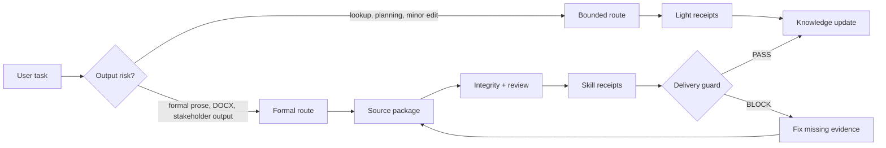

# Research Agent Starter Kit

一套 local-first research-agent 工作流：面向需要“可辩护正式输出”的研究项目，而不只是生成流畅草稿。

它帮助 coding agent 在下判断前先查 source，给小任务走轻量路由，让关键 gate 留下执行回执，并在 Word/PDF 或 stakeholder-facing 输出被当作可用版本前拦截薄弱交付。

[English README](README.md)

[](LICENSE)
[](https://www.python.org/)
[](#validation)

它可以配合 Codex、Claude Code、Cursor，或任何能读取本地文件并遵守 `SKILL.md` 指令的 coding agent 使用。这个 starter kit 本身是本地文件驱动；你选择的 agent 工具可能仍然有自己的登录、订阅、API-key 要求或 skill-discovery 行为，但本地 Python 检查脚本仍可独立使用。

它适合有 citation、evidence、compliance、style 或 delivery 要求的研究项目：dissertation、thesis、article、report、proposal、evidence synthesis 和其他结构化研究工作。

它不能替代 source review、ethics/compliance approval、supervisor judgement、peer review 或机构凭据。设计目标是让这些限制在 polished prose 掩盖问题之前就显露出来。

## 它保护什么

| Risk | Guard |
|---|---|
| 流畅草稿编造事实，或把 metadata 当证据 | Source-first gate 和 source-readiness matrix |
| 小型 lookup 被误路由成昂贵正式写作流程 | Bounded routing 和 light receipts |
| 切换阶段后忽略旧决定 | Stage Continuity 和 Token-Aware Recall |
| Skill 只是被声称使用，但没有真正执行 | Skill execution receipts |
| Word/PDF 交付丢失结构或跳过检查 | Formal delivery guard 和 DOCX structure/layout checks |

## 路由示例

```bash
python scripts/agent_runtime.py "Run methodology literature search and rematch sources" --window Production
# bounded_source_planning -> source planning、search、citation boundary、learning loop 的轻量回执

python scripts/agent_runtime.py "Write two formal methodology paragraphs synthesising the methodology literature" --window Production
# formal_research_output -> source-first、Material Passport、integrity preflight、cognitive planning、self-review、style/document gates
```


## 它如何工作



这张图只展示首页需要理解的核心控制路径：小任务保持轻量，正式输出进入 source package、review evidence、receipt 和 delivery guard。完整 formal-writing chain 仍然保留在项目 skills 和 scripts 里。

这套流程在关键位置会变严格：

1. **写作前先查证据** — 正式 claim 需要已读过的 source section 或 source note 支持；metadata、保存的 PDF 或搜索结果本身不够。不足时必须明确标记 `NEEDS VERIFICATION`。
2. **起草前先规划论证** — 先明确 claim、gap、evidence status、warrant 和 section role。
3. **交付前先审查** — 草稿必须经过 source packaging、integrity preflight、cognitive planning、self-review、authorial voice check、style fingerprint scan、skill execution receipts 和 delivery gate，才能被当作可用的正式输出。
4. **审查必须具体** — two-pass self-review 要记录具体弱点、修改动作和新的二轮判断。
5. **知识库更新要有边界** — 有用决定和已审 source 可以进入知识库，但 retrieval 和 notes 只是导航层，不能替代 source readiness。

## 最新更新

**v1.7.0** 加入了 bounded routing 和 session-log integrity checks。

这意味着小任务可以保持小任务。source planning、literature priority sorting、source lookup、citation-key 修复、reference-format 小改和 typo edit 会使用 light receipt set；只有任务明确要求正式正文、Word/DOCX、stakeholder-facing/submission-facing 输出，或修改 protected source-of-record 时，才升级到 full formal-writing chain。单纯出现 methodology 或 literature review 关键词，不再自动触发完整正式写作流程。

它还新增了 `scripts/session_log_integrity_check.py`。维护审计可以检查 JSONL 是否损坏、window label 是否非法、runtime receipt 和 event window 是否不一致、session_start/session_end 是否成对，而不是把日志漂移当作无关紧要的 bookkeeping。

**v1.6.0** 加入了 Stage Continuity 和 Token-Aware Recall。

这意味着长期项目在切换阶段后，不应该只根据当前聊天直接写后续产物。比如 method plan、instrument、analysis plan、stakeholder-facing memo 这类高风险任务，需要先看 Stage Graph 里的上游 source-of-record，再写 Stage Continuity Capsule，说明继承了什么、哪些还没确认、哪些不能擅自改变。

它也会控制 token 消耗：纯排版、拼写、日志和 Git bookkeeping 不会被迫做完整上游审计；真正改变方法、设计、分析或正式 claim 的任务才进入 targeted recall。用户如果要求跳过上游检查，agent 必须先指出被跳过的依赖；如果用户接受风险，只能记录为 override risk，不能说成 gate pass。

**v1.5.2** 加入了 DOCX Structure and Layout Guards。

这意味着正式 Word 交付现在可以拦截一种常见渲染失败：Markdown 表格在 Word 里变成管道符文本段落，或新版 DOCX 相比上一版已接受 Word 丢失表格、标题、列表或可见层级。这是交付流程里的确定性保护，不替代人工页面检查，也不替代项目自己的格式要求。

**v1.5.1** 加入了 Style Fingerprint Gate 和 Skill Execution Receipts。

这意味着正式写作现在可以要求关键检查留下本地证据回执。runtime 会按任务类型列出必做回执；扫描类 gate 会生成可核对报告；delivery guard 可以因为缺少回执而拦截交付，而不是接受一句“已检查”。回执只能说明证据文件存在，不证明分析已经足够，也不证明证据本身为真。

这次也加入了确定性的固定词组清单扫描，用来检查反复出现的二元否定对比句式，例如 `rather than`、`not...but`、`不是...而是`、`而不是`。它是写作质量保护，不是通用 stylometric scan，也不是 AI detector。

**v1.5.0** 加入了 Authorial Voice Integrity 和 Real Project Operating Guide。

这意味着“帮我去 AI 味”“humanise this”“降低 AI 率”这类请求会被路由为作者声音、学术/专业诚信和 evidence-led style 任务。系统不会承诺 AI detector 分数，也不会使用检测规避策略。

它还新增了一份实操指南，帮助用户把 starter kit 从模板变成能真正工作的 dissertation、thesis、manuscript、report 或 evidence-synthesis agent。

**v1.4.0** 加入了 Material Passport 和 Formal Delivery Guard。

这意味着正式研究文档在继续推进前会先生成 evidence passport；最终 Word/PDF/给 reviewer 或 stakeholder 的交付，如果缺少 lock、integrity、citation、compliance 或 requirement evidence，会被明确拦截。

**v1.3.1** 加入了 release-surface verification 和 public sync policy。

这意味着系统现在会在声称公开发布完成前，检查 GitHub 页面上真实可见的 release、README、About/sidebar、topics 和链接；同时明确哪些内容可以从私人项目同步到公开模板，哪些内容必须留在本地。

**v1.3.0** 加入了更清晰的 Obsidian 入口说明，以及给没有 Claude Code 用户使用的 external-review fallback。External review 仍然只是建议层。

## 快速开始

如果你使用 Obsidian：**请把 knowledge-base/ 作为 Obsidian vault 打开，不要打开整个仓库根目录。** 见 [Obsidian Setup](docs/OBSIDIAN_SETUP.md)。

如果你没有 Claude Code：使用 external-review bundle workflow，把生成的 prompt 复制到另一个 Codex、ChatGPT、Claude、Gemini 或人工 review 流程。见 [External Review Options](docs/EXTERNAL_REVIEW_OPTIONS.md)。

如果你想把这套模板真正用到自己的项目上，先读 [Real Project Operating Guide](docs/REAL_PROJECT_OPERATING_GUIDE.md)。

```bash
git clone https://github.com/JonasLee12/research-agent-starter-kit.git
cd research-agent-starter-kit

python3 -m venv .venv
source .venv/bin/activate

pip install -r requirements.txt

# AGENTS.md 是项目配置文件，用来告诉 agent 你的研究主题、资料来源和必须遵守的规则。
cp templates/AGENTS.example.md AGENTS.md
# 在 AGENTS.md 中填写你的研究主题、资料来源、规则和交付要求。

python scripts/run_skill_evals.py
python scripts/validate_agent_schemas.py
python -m unittest discover -s tests
```

可选 neural vector retrieval：

```bash
pip install -r requirements-vector.txt
bash scripts/run_vector_index.sh
```

## 它解决什么问题

| Research-agent problem | Kit mechanism | Practical result |
|---|---|---|
| Agent 容易编造事实或要求 | Source-first gate | 正式写作先查本地证据，不靠记忆发挥 |
| 文稿看起来流畅，但论证很薄 | Cognitive frameworks + self-review loop | 交付前检查 claim、warrant 和段落推进 |
| 切换阶段后忘记回顾旧决定 | Stage Continuity + Token-Aware Recall | Agent 根据 Stage Graph 做最小必要回顾，并在任务变化时重新检查 recall tier |
| Source planning 被误当作正式写作 | Bounded runtime routes | Source planning、lookup 和小修先走 light receipt set，直到任务真的要求正式输出 |
| 用户想“去 AI 味”或降低 AI 率 | Authorial voice integrity | 拒绝检测规避框架，改为 evidence-led authorial voice 工作 |
| Skill 被提到但没有真正执行 | Skill execution receipts | 必做检查必须留下本地证据回执；回执不是质量证明 |
| 正式文本反复使用机械式对比句 | Style fingerprint gate | 用固定词组清单扫描 `rather than` / `not...but` 等重复模板 |
| 引用格式看似正确，但不一定支持正文 | Citation audit and source-readiness matrix | 区分 citation consistency 和 claim support |
| 知识散落在聊天、文件和笔记里 | Self-growing KB workflow | 新材料经过 raw inbox、growth queue、compiled wiki，保留边界 |
| Retrieval 结果容易被误当证据 | Retrieval protocol | 检索结果只作为候选，必须回到 source section review |
| 正式文档太早交付 | Delivery guard and checkpoints | 缺少必要审查时阻止正式输出 |
| 用户没有 Claude Code | External-review bundle | 仍可通过 Codex、ChatGPT、其他 LLM chat 或人工 reviewer 获取第二意见 |
| 公开分享时可能泄露私人材料 | Privacy checks and `.gitignore` boundaries | 本地索引、audit logs、raw/private data 默认不发布 |

## 核心组成

| Piece | Where it lives | What it does |
|---|---|---|
| Skills | `.agents/skills/` | 任务路由、写作、审查、source check、知识库和维护规则 |
| Runtime routing | `scripts/agent_runtime.py` | 判断任务类型，列出需要的 skills、files 和 gates |
| Session log integrity | `scripts/session_log_integrity_check.py` | 检查 JSONL、window label、runtime/window alignment、session 配对和 timestamp |
| Source readiness | `knowledge-base/SOURCE_READINESS_MATRIX.md` | 记录 source 是 metadata-only、partly reviewed，还是 citation-ready |
| Self-growing KB | `knowledge-base/self-growing/` | 管理可控的知识库增长 |
| Retrieval | `scripts/local_retrieval_search.py`, `scripts/build_agent_index.py` | 建立本地可检索索引，但不替代 source review |
| Optional vector search | `scripts/build_vector_index.py` | 安装 ChromaDB + sentence-transformers 后可用 |
| Integrity preflight | `.agents/skills/academic-integrity-preflight/`, `scripts/academic_integrity_preflight.py` | 检查 prompt residue、placeholder、假引用、unsupported claims 和 disclosure-boundary 风险 |
| Authorial voice integrity | `.agents/skills/authorial-voice-integrity/`, `scripts/authorial_voice_scan.py`, `research-wiki/AI_WRITING_AUTHORIAL_VOICE_POLICY.md` | 提升作者判断和学术/专业表达，但不承诺 AI detector 结果 |
| Style fingerprint gate | `.agents/skills/style-fingerprint-gate/`, `scripts/style_fingerprint_scan.py` | 在正式交付前扫描重复的二元否定对比句式 |
| Skill execution receipts | `scripts/skill_execution_receipt.py`, `research-wiki/SKILL_EXECUTION_RECEIPT_PROTOCOL.md` | 记录 task ID、skill、stage、status、evidence path 和 evidence hash |
| Material Passport | `.agents/skills/material-passport/`, `scripts/material_passport.py` | 在正式文档推进前打包已记录的 source readiness、用户提供的 compliance/requirement status、citation boundary 和 `TO CONFIRM` |
| Formal delivery guard | `.agents/skills/formal-delivery-guard/`, `scripts/pre_delivery_lock.py`, `scripts/formal_delivery_guard.py` | 创建/检查 pre-delivery lock，并在缺少必要证据或 DOCX 结构/排版检查失败时阻止正式交付 |
| DOCX structure/layout guards | `scripts/markdown_docx_structure_check.py`, `scripts/docx_layout_review_check.py` | 检查 Markdown 表格是否变成真实 Word 表格，并检查重要 DOCX 修订是否悄悄丢失可见结构 |
| Stage continuity | `research-wiki/STAGE_GRAPH.md`, `research-wiki/STAGE_CONTINUITY_PROTOCOL.md`, `scripts/stage_recall_policy.py`, `scripts/stage_continuity_capsule_check.py` | 防止后续阶段工作忽略上游决定，同时用 recall tier 控制 token 消耗 |
| External review fallback | `scripts/build_external_review_bundle.py`, `templates/prompts/EXTERNAL_REVIEWER_PROMPT.md` | 生成本地质审包且不会自动上传；是否复制给 Codex、ChatGPT、Claude、Gemini 或人工 reviewer 由用户决定 |
| Release surface verification | `.agents/skills/release-surface-verification/` | 在声称发布完成前，检查用户可见的 GitHub release 页面、About/sidebar、topics、渲染后的 README/docs 和公开链接 |
| Public sync policy | `PUBLIC_SYNC_POLICY.md` | 说明 shared core、private-only、public-only、同步检查和 release 边界 |
| Delivery pipeline | `research-wiki/DOCUMENT_PIPELINE.md` | 把正式工作拆成 THINKING、WRITING、DELIVERY 三个 checkpoint |

## 范围和限制

这套系统不会假装自己能证明一切。

- 它不能在没有 source-section review 的情况下证明某个 source 支持某个 claim。
- 它不能把 retrieval 结果直接变成证据。
- 它不能在没有合法机构凭据的情况下访问 Scopus、Web of Science、EBSCO 等订阅数据库。
- 它不能替代 ethics approval、compliance approval、peer review 或 supervisor approval。
- 它不能保证分数、发表、资助、录用或正式批准。
- 它不能阻止用户绕过 agent pipeline 手动复制文件。
- Skill receipts 只能证明有执行证据，不证明底层分析已经足够、真实或已被认真采纳。
- Style 和 authorial voice scan 是写作质量顾问检查，不是 AI detector。

这些限制不是缺陷。它们的作用是让证据不足、引用不足、交付风险变得可见。

## 验证

当前公开模板显示 **48/48 skill evaluations passing**。
这些是轻量级 static/routing checks，用来检查高风险流程是否指向真实文件和工具，不证明 agent 行为质量。这个 badge 反映的是已发布模板状态；你自定义系统后应重新运行下面的检查。

```bash
python scripts/run_skill_evals.py
python scripts/validate_agent_schemas.py
python scripts/session_log_integrity_check.py --strict --no-report
python -m unittest discover -s tests
python scripts/run_behavioral_evidence_checks.py
bash scripts/privacy_check.sh
```

正式交付辅助工具：

```bash
python scripts/material_passport.py --artifact path/to/draft.md --scope short
python scripts/authorial_voice_scan.py --target path/to/draft.md
python scripts/style_fingerprint_scan.py path/to/draft.md --strict
python scripts/skill_execution_receipt.py create --task-id my-task --skill style-fingerprint-gate --stage writing --artifact path/to/draft.md --status PASS --evidence audit-reports/style-fingerprint/my-report.md
python scripts/pre_delivery_lock.py create --target path/to/final.docx --runtime-receipt path/to/receipt.md --material-passport path/to/passport.md --source-map path/to/source-map.md --integrity-preflight path/to/integrity.md --quality-gate path/to/quality.md
python scripts/formal_delivery_guard.py --artifact path/to/final.docx --source path/to/source.md --require-style-fingerprint --require-skill-receipts --task-id my-task
python scripts/markdown_docx_structure_check.py --markdown path/to/source.md --docx path/to/final.docx --previous-docx path/to/accepted.docx
python scripts/docx_layout_review_check.py --docx path/to/final.docx --markdown path/to/source.md --previous-docx path/to/accepted.docx
```

DOCX 例外旗标，例如 `--skip-structure-parity`、`--skip-layout-review`、`--allow-table-loss` 和 `--allow-layout-regression`，必须同时提供 `--layout-decision-reason`。这些旗标只用于明确记录过的排版决定，不能当作方便绕过。

可选 vector smoke test：

```bash
bash scripts/run_vector_index.sh
```

## 更多设置

<details>
<summary>根据你的研究项目进行自定义</summary>

### 添加项目要求

把 marking criteria、client requirements、ethics/compliance notes 或正式 guidance 放在 `university-guidance/`、`compliance/` 或你自己的项目文件夹。格式可参考 `university-guidance/EXAMPLE_RUBRIC_GUIDE.md`。

### 添加你自己的 skill

在 `.agents/skills/your-skill-name/` 下创建 `SKILL.md`，并在 `research-wiki/SKILL_EVAL_REGISTRY.md` 注册 eval test cases。具体要求见 [CONTRIBUTING.md](CONTRIBUTING.md)。

### 让私人项目和公开模板保持同步

同步前先读 [Public Sync Policy](PUBLIC_SYNC_POLICY.md)。它会区分哪些是可复用的 shared-core 改进，哪些是私人项目材料，不能发布到公开模板。

这个 policy 会说明：

- 哪些 shared core 文件可以通用化后同步；
- 哪些 private-only 文件绝不能公开；
- 什么 release-surface 检查完成后，才能说更新已经完成。

### 配置 Zotero

参考 `research-wiki/ZOTERO_AND_CITATION_WORKFLOW_SPEC.md`。

### 搭建 self-growing knowledge base

先读 `knowledge-base/self-growing/README.md`，然后运行：

```bash
python scripts/kb_health_check.py
python scripts/build_agent_index.py --rebuild --summary
python scripts/local_retrieval_search.py --rebuild --query "source readiness"
```

### 安全设置 Obsidian

请把 knowledge-base/ 作为 Obsidian vault 打开，不要打开整个仓库根目录。

如果想要更干净的个人笔记库，把 `templates/obsidian-vault/` 复制到仓库外部，再用 Obsidian 打开复制后的文件夹。

见 [Obsidian Setup](docs/OBSIDIAN_SETUP.md)。

### 没有 Claude Code 时获取外部第二意见

生成本地 review bundle：

```bash
python scripts/build_external_review_bundle.py path/to/draft.md
```

然后检查 `privacy_scan.md`。如果安全，再把 `EXTERNAL_REVIEW_PROMPT.md` 复制到另一个 Codex、ChatGPT、Claude、Gemini 或人工 review 流程。

见 [External Review Options](docs/EXTERNAL_REVIEW_OPTIONS.md)。

### 调整 cognitive frameworks

你可以修改 `.agents/skills/cognitive-frameworks/SKILL.md`，让 gap classifications、warrant quality tests 或 rhetorical moves 更适合你的学科。

</details>

## 文档

<details open>
<summary>建议先读这些</summary>

- [Architecture](docs/architecture.md) — 完整系统图
- [Dual Window Guide](docs/DUAL_WINDOW_GUIDE.md) — Production 和 Maintenance 窗口如何分工
- [Skill Development Guide](docs/SKILL_DEVELOPMENT_GUIDE.md) — 如何创建和测试新的 skill
- [Weekly Literature Gap-Watch Automation](docs/WEEKLY_LITERATURE_GAP_WATCH_AUTOMATION.md) — candidate-only weekly 文献监测
- [Obsidian Setup](docs/OBSIDIAN_SETUP.md) — 打开干净知识层，不要打开仓库根目录
- [External Review Options](docs/EXTERNAL_REVIEW_OPTIONS.md) — 把 Claude Code、Codex、ChatGPT、Gemini 或人工 review 作为建议层使用
- [Self-Growing Knowledge Base](knowledge-base/self-growing/README.md) — 可控知识库增长工作流
- [Retrieval Protocol](research-wiki/RETRIEVAL_PROTOCOL.md) — 本地 retrieval 各层如何协同
- [Document Pipeline](research-wiki/DOCUMENT_PIPELINE.md) — staged checkpoint delivery process
- [AI Writing Authorial Voice Policy](research-wiki/AI_WRITING_AUTHORIAL_VOICE_POLICY.md) — 合规的作者声音边界
- [Skill Execution Receipt Protocol](research-wiki/SKILL_EXECUTION_RECEIPT_PROTOCOL.md) — 必做 skill 的执行证据回执
- [Software and Plugin Requirements](docs/SOFTWARE_AND_PLUGIN_REQUIREMENTS.md) — 必需和可选工具

</details>

## 致谢

开源项目和方法来源见 [ACKNOWLEDGEMENTS.md](ACKNOWLEDGEMENTS.md)。

## 许可

[MIT](LICENSE)
