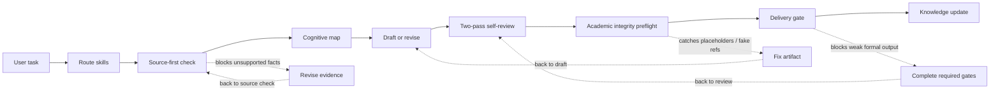

# Research Agent Starter Kit

搭建一个本地 research agent：先思考，再写作；先查证据，再下判断；正式交付前拦截不满足要求的输出。

[English README](README.md)

[](LICENSE)
[](https://www.python.org/)
[](#validation)

它可以配合 Codex、Claude Code、Cursor，或任何能读取本地文件并遵守 `SKILL.md` 指令的 coding agent 使用。这个 starter kit 本身是本地文件驱动；你选择的 agent 工具可能仍然有自己的登录、订阅或 API-key 要求。

这套 starter kit 适合 dissertation、thesis、article、report、proposal 和其他结构化研究项目。目标很明确：让 AI 帮你研究和写作，但不能随便编造事实、跳过证据、忽略引用和交付风险。

它不能替代 source review、ethics/compliance approval、supervisor judgement、peer review 或机构凭据。这些限制会被明确显示出来。

## 它如何工作



虚线代表 revision loop。意思是：如果某个 gate 发现问题，agent 应该停下来修复，再重新运行相关检查。

这套流程在关键位置会变严格：

1. **写作前先规划** — 先明确 claim、gap、evidence status、warrant 和 section role。
2. **带着证据边界写作** — 正式 claim 要么有本地证据，要么明确标记 `NEEDS VERIFICATION`。
3. **交付前先审查** — 草稿必须经过 self-review、integrity check 和 delivery gate，才能被当作可用的正式输出。

## 最新更新

**v1.2.0** 加入了 self-growing knowledge base、本地 retrieval 工具、可选 neural vector search，以及 academic-integrity preflight gate。

这意味着系统现在不只管写作和审查，也能管理知识库增长：raw inbox -> growth queue -> compiled wiki -> source-aware retrieval。

## 快速开始

如果你使用 Obsidian：**请把 knowledge-base/ 作为 Obsidian vault 打开，不要打开整个仓库根目录。** 见 [Obsidian Setup](docs/OBSIDIAN_SETUP.md)。

```bash
git clone https://github.com/JonasLee12/research-agent-starter-kit.git
cd research-agent-starter-kit

python3 -m venv .venv
source .venv/bin/activate

pip install -r requirements.txt

# AGENTS.md 是项目配置文件，用来告诉 agent 你的研究主题、资料来源和必须遵守的规则。
cp templates/AGENTS.example.md AGENTS.md
# 在 AGENTS.md 中填写你的研究主题、资料来源、规则和交付要求。

python scripts/run_skill_evals.py
python scripts/validate_agent_schemas.py
python -m unittest discover -s tests
```

可选 neural vector retrieval：

```bash
pip install -r requirements-vector.txt
bash scripts/run_vector_index.sh
```

## 它解决什么问题

| Research-agent problem | Kit mechanism | Practical result |
|---|---|---|
| Agent 容易编造事实或要求 | Source-first gate | 正式写作先查本地证据，不靠记忆发挥 |
| 文稿看起来流畅，但论证很薄 | Cognitive frameworks + self-review loop | 交付前检查 claim、warrant 和段落推进 |
| 引用格式看似正确，但不一定支持正文 | Citation audit and source-readiness matrix | 区分 citation consistency 和 claim support |
| 知识散落在聊天、文件和笔记里 | Self-growing KB workflow | 新材料经过 raw inbox、growth queue、compiled wiki，保留边界 |
| Retrieval 结果容易被误当证据 | Retrieval protocol | 检索结果只作为候选，必须回到 source section review |
| 正式文档太早交付 | Delivery guard and checkpoints | 缺少必要审查时阻止正式输出 |
| 公开分享时可能泄露私人材料 | Privacy checks and `.gitignore` boundaries | 本地索引、audit logs、raw/private data 默认不发布 |

## 核心组成

| Piece | Where it lives | What it does |
|---|---|---|
| Skills | `.agents/skills/` | 任务路由、写作、审查、source check、知识库和维护规则 |
| Runtime routing | `scripts/agent_runtime.py` | 判断任务类型，列出需要的 skills、files 和 gates |
| Source readiness | `knowledge-base/SOURCE_READINESS_MATRIX.md` | 记录 source 是 metadata-only、partly reviewed，还是 citation-ready |
| Self-growing KB | `knowledge-base/self-growing/` | 管理可控的知识库增长 |
| Retrieval | `scripts/local_retrieval_search.py`, `scripts/build_agent_index.py` | 建立本地可检索索引，但不替代 source review |
| Optional vector search | `scripts/build_vector_index.py` | 安装 ChromaDB + sentence-transformers 后可用 |
| Integrity preflight | `.agents/skills/academic-integrity-preflight/`, `scripts/academic_integrity_preflight.py` | 检查 prompt residue、placeholder、假引用、unsupported claims 和 disclosure-boundary 风险 |
| Delivery pipeline | `research-wiki/DOCUMENT_PIPELINE.md` | 把正式工作拆成 THINKING、WRITING、DELIVERY 三个 checkpoint |

## 范围和限制

这套系统不会假装自己能证明一切。

- 它不能在没有 source-section review 的情况下证明某个 source 支持某个 claim。
- 它不能把 retrieval 结果直接变成证据。
- 它不能在没有合法机构凭据的情况下访问 Scopus、Web of Science、EBSCO 等订阅数据库。
- 它不能替代 ethics approval、compliance approval、peer review 或 supervisor approval。
- 它不能保证分数、发表、资助、录用或正式批准。
- 它不能阻止用户绕过 agent pipeline 手动复制文件。

这些限制不是缺陷。它们的作用是让证据不足、引用不足、交付风险变得可见。

## 验证

当前公开模板显示 **21/21 skill evaluations passing**。
这个 badge 反映的是已发布模板状态；你自定义系统后应重新运行下面的检查。

```bash
python scripts/run_skill_evals.py
python scripts/validate_agent_schemas.py
python -m unittest discover -s tests
python scripts/run_behavioral_evidence_checks.py
bash scripts/privacy_check.sh
```

可选 vector smoke test：

```bash
bash scripts/run_vector_index.sh
```

## 更多设置

<details>
<summary>根据你的研究项目进行自定义</summary>

### 添加项目要求

把 marking criteria、client requirements、ethics/compliance notes 或正式 guidance 放在 `university-guidance/`、`compliance/` 或你自己的项目文件夹。格式可参考 `university-guidance/EXAMPLE_RUBRIC_GUIDE.md`。

### 添加你自己的 skill

在 `.agents/skills/your-skill-name/` 下创建 `SKILL.md`，并在 `research-wiki/SKILL_EVAL_REGISTRY.md` 注册 eval test cases。具体要求见 [CONTRIBUTING.md](CONTRIBUTING.md)。

### 配置 Zotero

参考 `research-wiki/ZOTERO_AND_CITATION_WORKFLOW_SPEC.md`。

### 搭建 self-growing knowledge base

先读 `knowledge-base/self-growing/README.md`，然后运行：

```bash
python scripts/kb_health_check.py
python scripts/build_agent_index.py --rebuild --summary
python scripts/local_retrieval_search.py --rebuild --query "source readiness"
```

### 安全设置 Obsidian

请把 knowledge-base/ 作为 Obsidian vault 打开，不要打开整个仓库根目录。

如果想要更干净的个人笔记库，把 `templates/obsidian-vault/` 复制到仓库外部，再用 Obsidian 打开复制后的文件夹。

见 [Obsidian Setup](docs/OBSIDIAN_SETUP.md)。

### 调整 cognitive frameworks

你可以修改 `.agents/skills/cognitive-frameworks/SKILL.md`，让 gap classifications、warrant quality tests 或 rhetorical moves 更适合你的学科。

</details>

## 文档

<details open>
<summary>建议先读这些</summary>

- [Architecture](docs/architecture.md) — 完整系统图
- [Dual Window Guide](docs/DUAL_WINDOW_GUIDE.md) — Production 和 Maintenance 窗口如何分工
- [Skill Development Guide](docs/SKILL_DEVELOPMENT_GUIDE.md) — 如何创建和测试新的 skill
- [Weekly Literature Gap-Watch Automation](docs/WEEKLY_LITERATURE_GAP_WATCH_AUTOMATION.md) — candidate-only weekly 文献监测
- [Obsidian Setup](docs/OBSIDIAN_SETUP.md) — 打开干净知识层，不要打开仓库根目录
- [Self-Growing Knowledge Base](knowledge-base/self-growing/README.md) — 可控知识库增长工作流
- [Retrieval Protocol](research-wiki/RETRIEVAL_PROTOCOL.md) — 本地 retrieval 各层如何协同
- [Document Pipeline](research-wiki/DOCUMENT_PIPELINE.md) — staged checkpoint delivery process
- [Software and Plugin Requirements](docs/SOFTWARE_AND_PLUGIN_REQUIREMENTS.md) — 必需和可选工具

</details>

## 致谢

开源项目和方法来源见 [ACKNOWLEDGEMENTS.md](ACKNOWLEDGEMENTS.md)。

## 许可

[MIT](LICENSE)
