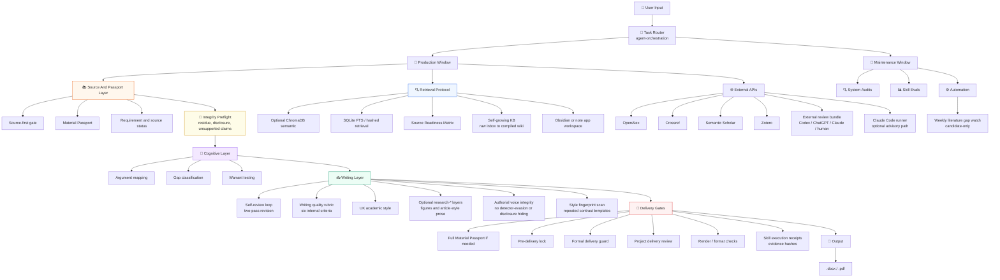

# System Architecture

```mermaid
graph TD
    A["👤 User Input"] --> B["🔀 Task Router<br/>agent-orchestration"]

    B --> C["📖 Production Window"]
    B --> D["🔧 Maintenance Window"]

    C --> S["📚 Source And Passport Layer"]
    S --> S1["Source-first gate"]
    S --> S2["Material Passport"]
    S --> S3["Requirement and source status"]

    S --> Q["🧾 Integrity Preflight<br/>residue, disclosure, unsupported claims"]
    Q --> E["🧠 Cognitive Layer"]
    E --> E1["Argument mapping"]
    E --> E2["Gap classification"]
    E --> E3["Warrant testing"]

    E --> F["✍️ Writing Layer"]
    F --> F1["Self-review loop<br/>two-pass revision"]
    F --> F2["Writing quality rubric<br/>six internal criteria"]
    F --> F3["UK academic style"]
    F --> F4["Optional research-* layers<br/>figures and article-style prose"]
    F --> F6["Authorial voice integrity<br/>no detector-evasion or disclosure hiding"]
    F --> F7["Style fingerprint scan<br/>repeated contrast templates"]

    F --> G["🚦 Delivery Gates"]
    G --> G1["Full Material Passport if needed"]
    G --> G2["Pre-delivery lock"]
    G --> G3["Formal delivery guard"]
    G --> G4["Project delivery review"]
    G --> G5["Render / format checks"]
    G --> G6["Skill execution receipts<br/>evidence hashes"]

    G --> H["📄 Output"]
    H --> H1[".docx / .pdf"]

    C --> I["🔍 Retrieval Protocol"]
    I --> I1["Optional ChromaDB semantic"]
    I --> I2["SQLite FTS / hashed retrieval"]
    I --> I3["Source Readiness Matrix"]
    I --> I4["Self-growing KB<br/>raw inbox to compiled wiki"]
    I --> I5["Obsidian or note app workspace"]

    C --> J["🌐 External APIs"]
    J --> J1["OpenAlex"]
    J --> J2["Crossref"]
    J --> J3["Semantic Scholar"]
    J --> J4["Zotero"]
    J --> J5["External review bundle<br/>Codex / ChatGPT / Claude / human"]
    J --> J6["Claude Code runner<br/>optional advisory path"]

    D --> K["🔍 System Audits"]
    D --> L["📊 Skill Evals"]
    D --> M["⚙️ Automation"]
    M --> M1["Weekly literature gap watch<br/>candidate-only"]

    style E fill:#f3e8ff,stroke:#7c3aed
    style F fill:#ecfdf5,stroke:#059669
    style S fill:#fff7ed,stroke:#ea580c
    style Q fill:#fefce8,stroke:#ca8a04
    style G fill:#fef2f2,stroke:#dc2626
    style I fill:#eff6ff,stroke:#2563eb
```
