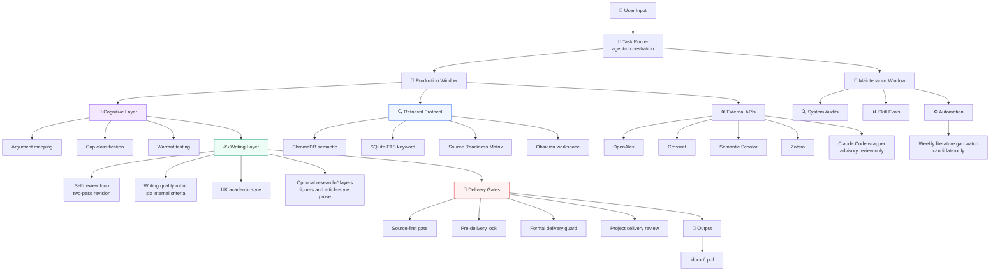

# System Architecture

```mermaid
graph TD
    A["👤 User Input"] --> B["🔀 Task Router<br/>agent-orchestration"]

    B --> C["📖 Production Window"]
    B --> D["🔧 Maintenance Window"]

    C --> E["🧠 Cognitive Layer"]
    E --> E1["Argument mapping"]
    E --> E2["Gap classification"]
    E --> E3["Warrant testing"]

    E --> F["✍️ Writing Layer"]
    F --> F1["Self-review loop<br/>two-pass revision"]
    F --> F2["Writing quality rubric<br/>six internal criteria"]
    F --> F3["UK academic style"]
    F --> F4["Optional research-* layers<br/>figures and article-style prose"]

    F --> G["🚦 Delivery Gates"]
    G --> G1["Source-first gate"]
    G --> G2["Pre-delivery lock"]
    G --> G3["Formal delivery guard"]
    G --> G4["Project delivery review"]

    G --> H["📄 Output"]
    H --> H1[".docx / .pdf"]

    C --> I["🔍 Retrieval Protocol"]
    I --> I1["ChromaDB semantic"]
    I --> I2["SQLite FTS keyword"]
    I --> I3["Source Readiness Matrix"]
    I --> I4["Obsidian workspace"]

    C --> J["🌐 External APIs"]
    J --> J1["OpenAlex"]
    J --> J2["Crossref"]
    J --> J3["Semantic Scholar"]
    J --> J4["Zotero"]
    J --> J5["Claude Code wrapper<br/>advisory review only"]

    D --> K["🔍 System Audits"]
    D --> L["📊 Skill Evals"]
    D --> M["⚙️ Automation"]
    M --> M1["Weekly literature gap watch<br/>candidate-only"]

    style E fill:#f3e8ff,stroke:#7c3aed
    style F fill:#ecfdf5,stroke:#059669
    style G fill:#fef2f2,stroke:#dc2626
    style I fill:#eff6ff,stroke:#2563eb
```
